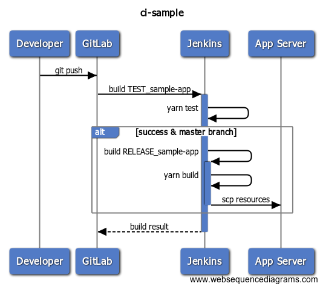

# CI Sample


# Pre Requirements
- docker
- docker-compose
- git-lfs
  - https://git-lfs.github.com/

# Setup

```console
$ git clone git@github.com:pataiji/ci-sample.git
$ git lfs pull
$ docker-compose up -d

# After GitLab start
$ git submodule update -i
```

# URLs
- Jenkins
  - http://localhost:8080
  - ID: admin / Password: admin
- GitLab
  - http://localhost:8081
  - ID: root / Password: admin1234
- App Server
  - http://localhost:8082
